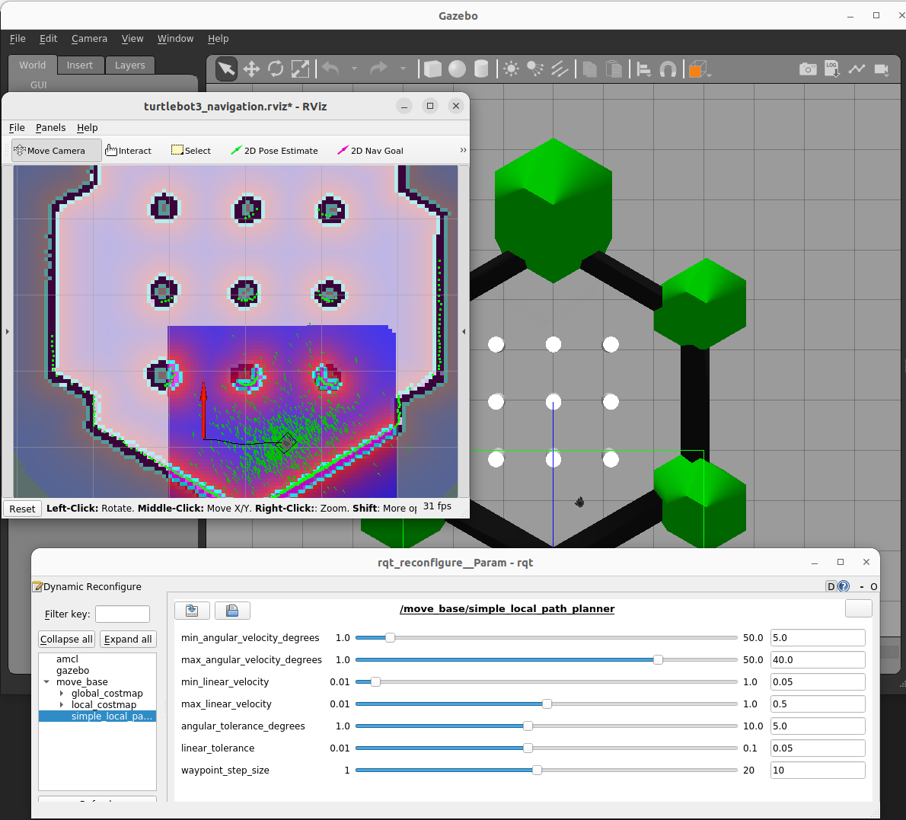
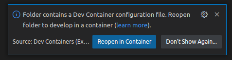
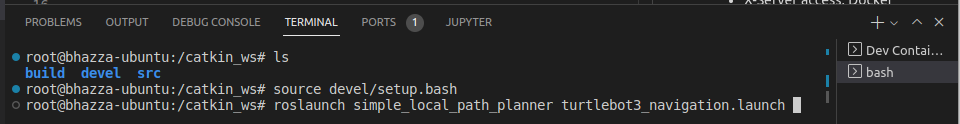

# simple_local_path_planner

This repository contains the implementation of a simple local path planner to satisfy the requirements of a coding exercise ([see requirements checklist below](#requirements)).

All development and testing has been carried out using Ubuntu 22.04 host, with ROS Noetic and [TurtleBot3 Simulation](https://emanual.robotis.com/docs/en/platform/turtlebot3/simulation/#virtual-navigation-with-turtlebot3) run in Docker, and VS code connected remotely. Note, this package may work with other ROS versions, but this is untested.

## Docker

This package has been developed and tested using docker. This is both for user-convience, and because my host PC is running Ubuntu 22.04, which is not directly supported by ROS Noetic (a requirement of this task). The following section details several ways to run this package in docker.

### Prerequisites
 - Docker & Docker Compose: Suggest installing [Docker Desktop](https://docs.docker.com/desktop/) which contains all docker dependencies. For Ubuntu these instructions should work: [Linux install](https://docs.docker.com/desktop/install/ubuntu/), making sure to carry out the [post-install steps](https://docs.docker.com/engine/install/linux-postinstall/).
 - X-Server access: Docker will need to be able to access x-server. More information can be found in the [ROS GUI Docker Tutorial](http://wiki.ros.org/docker/Tutorials/GUI). For linux users, run the following the any console before running docker. 

        xhost +local:root # Warning: Unsecure. Refer to above reference tutorial for alternative methods

### Command Line

To run from command line, from the package directory

    docker compose build
    docker compose run simplelocalpathplanner

You should be greeted by the simulator running turtlebot, with Rviz ready to accept your requested "2D Nav Goal", and rqt_reconfigure ready for you to tune the parameters of simple_local_path_planner (you may have to click the "Refresh" button for it to show up)

### VS Code

Note: I added "xhost +local:root" to my ~/.bashrc to provide GUI access when running docker in VS Code (there's probably a better way)

    echo "xhost +local:docker" >> ~/.bashrc

You will need the following extensions (Todo: double check this list is complete):
 - ms-azuretools.vscode-docker
 - ms-vscode-remote.vscode-remote-extensionpack

Other extensions will be installed to the container during the build process, as defined by the [.devcontainer/devcontainer.json](.devcontainer/devcontainer.json) file. Also, the [.vscode](.vscode) folder of this repo will be mounted to the container, so help with things like the ros noetic include path etc.

Once you have the required extensions, you should be able to open this package directory and be greeted with the following option at the bottom of the screen

Upon clicking "Reopen in Container", the Docker image should build and the workspace reopened in a container. You can then run the whole stack with the following:

    source /opt/ros/noetic/setup.bash # May not be necessary as workspace should already be build
    catkin_make # May not be necessary as workspace should already be build
    source devel/setup.bash 
    roslaunch simple_local_path_planner turtlebot3_navigation.launch

You should then be greeted with the same simulator as depicted above. 

### Development

For development purposes, it is easier to launch the Simulation and Navigation packages separately to the local planner package, so that the latter can be stopped and rebuilt without having to restart everything. To do this:

    roslaunch simple_local_path_planner turtlebot3_navigation.launch run_move_base:=false &
    roslaunch simple_local_path_planner run_move_base.launch

Note that doing this will result in much more debug messages. To change this, modify the [cfg/logging.conf](cfg/logging.conf) file

## Testing

Google test is used to implement unit testing. To run tests:

    catkin_make run_tests

or

    rosrun simple_local_path_planner unit_tests

## Coding Style

In order to maintain a consistent coding style - having inherited the existing style of ROS BaseLocalPlanner API - this package conforms to the [ROS coding style](http://wiki.ros.org/CppStyleGuide), even though I much prefer camel-case variable names and capitalised first letters on functions for C++. 

I do however deviate from their member variable naming convention; I've opted to prefix with "m_", rather than a trailing underscore. Small victories... :-)

## Requirements
#requirements

The following is a checklist of requirements specified by the coding exercise.

### Functional

- [X] Implement a ROS package which provides a new local planner for move_base. This planner must implement the nav_core::BaseLocalPlanner API for the nav_core package.
- [X] The local planner should receive a path from the global planner and generate linear and angular velocities to send to the base, as defined by the BaseLocalPlanner API.
- [X] The local planner should always rotate in-place towards the next point in the path, and then move towards it.
- [X] When arriving at the last point in the path, the planner should take the supplied goal orientation by rotating in-place.
- [X] For the purposes of this exercise, all obstacles can be ignored.

Optional (choose at least one):
- [X] Improve the computeVelocityCommands function to increase the accuracy and reliability of the path following algorithm. (***Velocities are proportional to distance/angle to target, parameters are configurable via dynamic reconfigure...***)
- [X] Use the available costmap to detect obstacles, and stop the robot before a collision occurs. (***Basic implementation considering only the pose of the robot (and not full footprint). Robot stops when cost threshold is exceeded (threshold configurable in rqt_reconfigure***)
- [ ] Implement a node that checks if the robot is following the calculated path and publishes a message on a ROS topic if the robot appears to be stuck and unable to follow the path.

### Non-Functional
- [X] Your planner must be implemented and compatible with ROS Noetic.(***Developed and tested in Noetic docker container***)
- [X] The code should follow best-practices and a consistent coding style.(***Used ROS coding style, as per "Coding Style" section above***)
- [X] You should include unit tests for the custom code you have written. (***Unit testing documented above***)
- [X] The code should include suitable documentation and comments as required.(***Instructions provided in README, and header files contain function descriptions***)
- [X] The local planner must be testable in Gazebo using the turtlebot 3 simulation (using the model burger). This launch file must be modified to bring up the navigation and localization of the platform, so that it is ready to receive goals from the standard move_base package interface using your new local planner.

### Deliverables
- [X] Your code that implements the system described above as an independent ROS package, including its own XML configuration, launch files, code, and tests.
- [X] Any documentation or test cases you have produced.
- [X] Details about how the code can be built and executed.

